# HDR Web Video Creator's Guide


<!-- TOC depthFrom:1 depthTo:8 withLinks:1 updateOnSave:1 orderedList:0 -->

- [HDR Video Creator Guide](#hdr-video-creator-guide)
	- [Introduction and Call For Quality](#introduction-and-call-for-quality)
- [How To Shoot HDR Video?](#how-to-shoot-hdr-video)
	- [Online Video Platform HDR Requirements](#online-video-platform-hdr-requirements)
		- [YouTube](#youtube)
		- [Vimeo](#vimeo)
	- [Recommended Hardware for HDR](#recommended-hardware-for-hdr)
	- [Recommended Software for HDR](#recommended-software-for-hdr)
- [Compiling ffmpeg With VP9 support](#compiling-ffmpeg-with-vp9-support)
	- [Requirements For Compiling ffmpeg With VP9 Support](#requirements-for-compiling-ffmpeg-with-vp9-support)
	- [Compile VP9 Enabled ffmpeg](#compile-vp9-enabled-ffmpeg)
	- [How To Compress an HDR Master to VP9](#how-to-compress-an-hdr-master-to-vp9)
	- [HDR Bitrates](#hdr-bitrates)
	- [YouTube Optimizations for ffmpeg & Resolve Studio](#youtube-optimizations-for-ffmpeg-resolve-studio)
	- [Results](#results)
- [HDR to SDR Conversion LUTs (YouTube)](#hdr-to-sdr-conversion-luts-youtube)
	- [Creating a Custom HDR to SDR LUT](#creating-a-custom-hdr-to-sdr-lut)
	- [Embedding Custom HDR to SDR LUT Files](#embedding-custom-hdr-to-sdr-lut-files)
- [FAQ](#faq)
- [Special Thanks](#special-thanks)
- [Author](#author)
- [Additional Resources](#additional-resources)

<!-- /TOC -->

## Introduction and Call For Quality

I am Ian Garrison, a computer nerd and Youtuber.  In April of 2017 I got a Panasonic GH5, a mirrorless digital camera which opened the doors to the possibility of making HDR10 videos.  Initially there was little  information on HDR10 video creation.  Over time new pieces of information were published in various places which I've collected for this guide.

HDR includes many improved properties which enable higher quality videos than we've seen at home, however it takes more time and effort to produce a spectacular image than it does with SDR video.  With HDR workflows being a little more complicated there is more room for mistakes and underwhelming results.  YouTube will not complain if you upload video from an old iphone 4 in 8-bit color depth, with 6 stops of dynamic range, left at 100 nits out of 1000, so long as the file contains HDR metadata.  There are multiple tutorials from people who do not even look at color scopes and do nothing else but set a contrast curve, crank up the saturation, transform color from wide to narrow back to wide again, and then export with HDR metadata and upload to YouTube.  Don't be that guy!  If you learn a few things about the components of HDR video you'll be informed enough to continually improve on your ability to deliver higher and higher quality videos.  Push HDR to its limits!

With my Panasonic GH5 camera my goal is to have the option to shoot and deliver HDR10 video to YouTube with the following properties.

* 10-bit color depth or higher in a wide color gamut like rec2020
* LOG or RAW color profiles to maximizes dynamic range
* 4k or higher resolution
* delivered in a high quality DNxHR HQX HDR master which can be uploaded to YouTube directly if file sizes and network speeds are acceptable for uploads.  I can upload at around 15Mbps according to speedtest.net so I might even tolerate at 50GB file upload as it would take about 8 hours to transfer while I sleep at night.

# What Is High Dynamic Range Video?

The concept of "dynamic range" for video describes the ratio between the maximum and minimum measurable light intensities (black and white).  To have a higher dynamic range means being able to record or display more detail in the darkest and brightest parts of an image.

<p align="center">
  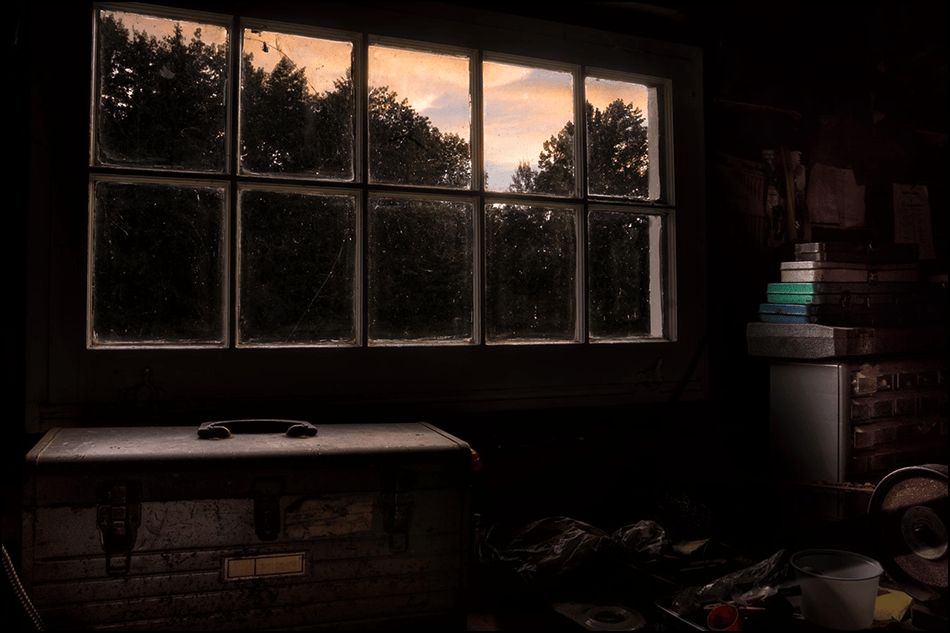
</p>

Consider the image above of the window and imagine how you might solve the problem of exposing the bright clouds outside without blowing them out while also getting good exposure inside the dark house for a painting on the inside wall next to the window for example.  In an SDR world you choose to expose the clouds and silhouette the room OR you expose the room and let the window blow out.  With HDR you can store and display more dynamic range so there is less of an extreme tradeoff on keeping your highlights.

<p align="center">
  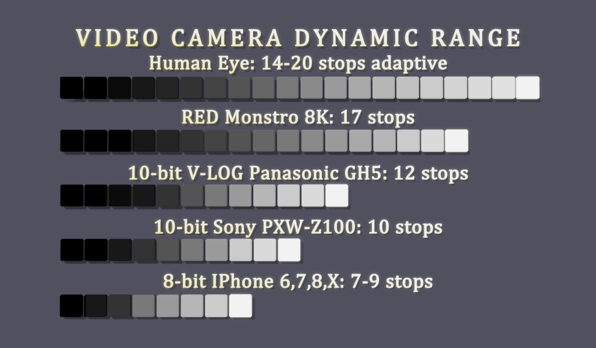
</p>

> "The dynamic range that can be perceived by the human eye in a single image is around 14 stops. [SDR video](https://en.wikipedia.org/wiki/Standard-dynamic-range_video) with a conventional gamma curve and a bit depth of 8-bits per sample has a dynamic range of about 6 stops. Professional SDR video with a bit depth of 10-bits per sample has a dynamic range of about 10 stops.  When HDR content is displayed on a 2,000 cd/m2 display with a bit depth of 10-bits per sample it has a dynamic range of 200,000:1 or 17.6 stops, a range not offered by the majority of current displays." -[Wikipedia article on High Dynamic Range Video](https://en.wikipedia.org/wiki/High-dynamic-range_video)

<p align="center">
  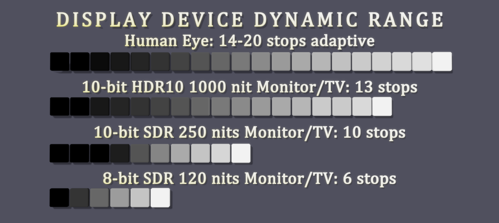
</p>

Nits are a candle power unit and we're going from 120-300 nits on all of our phones, televisions, and computer displays to 1000 nits initially for HDR10 with plans to go to 10,000 nits and beyond.

<p align="center">
  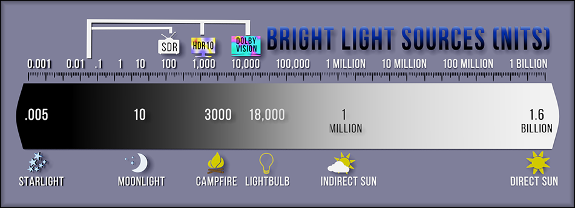
</p>

**YOU PROBABLY CANNOT SEE HDR (SPECIAL HARDWARE REQUIRED)** Most of today's display devices like Smartphones, Televisions, and LCD Monitors use SDR.  Those who work with the most high end professional graphics might have a 10-bit display on their workstation however they likely don't meet the 1000 nits brightness required for the current common standard HDR10.  If you try and display an HDR video on an SDR display it will likely look de-saturated with a flat low-contrast look like LOG footage.  Televisions manufactured since 2016 might have HDR10 support especially if the cost was over $2000 to $3000.  The latest IPhones and Android phones might have HDR support.  HDR computer displays have seen the lowest amount of available displays and general adoption but I expect to see more coming to market at CES in January of 2019.

<!-- [](https://www.youtube.com/watch?v=tO01J-M3g0U). -->

<p align="center">
  <a href="https://www.youtube.com/watch?v=tO01J-M3g0U" alt="The World in HDR in 4K (ULTRA HD) by Mysterybox.us"></a>
</p>

Fortunately, platforms like YouTube and Vimeo will automatically convert a copy of your HDR10 video as SDR and serve that which may give some the appearance that SDR players can play HDR videos.  Some HDR formats like Hybrid Log Gamma (HLG) include the HDR to SDR transforms in the spec which would allow an SDR display to view an HDR video transformed to SDR.  If you would like to see an excellent example of a high quality YouTube HDR/SDR video by some real professionals click on this link to [The World in HDR in 4K (ULTRA HD) by Mysterybox.us](https://www.youtube.com/watch?v=tO01J-M3g0U) or on the video above.  If you are on an SDR display you will not see the HDR stream and there are no side-by-side image comparisons one can share to show the real differences between HDR and SDR to viewers with an SDR display.

<p align="center">
  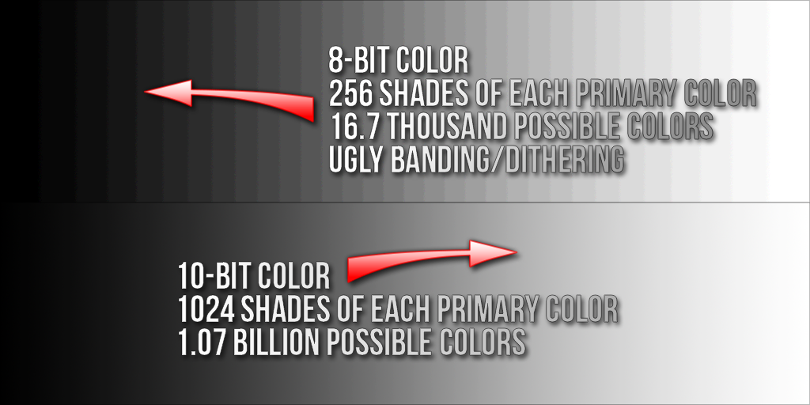
</p>

Most of the HDR standards are pushing for 10-bit color depth where 8-bit color depth has been ubiquitous.  As you can see this takes us from 16.7 possible colors in any common SDR video to at least a billion colors or more (Dolby Vision is 12-bit color depth!).  Much more subtle gradations of color can be displayed.  I am especially excited about this change as we're heading in a direction which could finally eliminate color dithering and banding artifacts which have been a plague on common electronics everywhere since the dawn of computing.  I'm tired of seeing media of a blue sky tainted by the jagged lines of color banding.

<p align="center">
  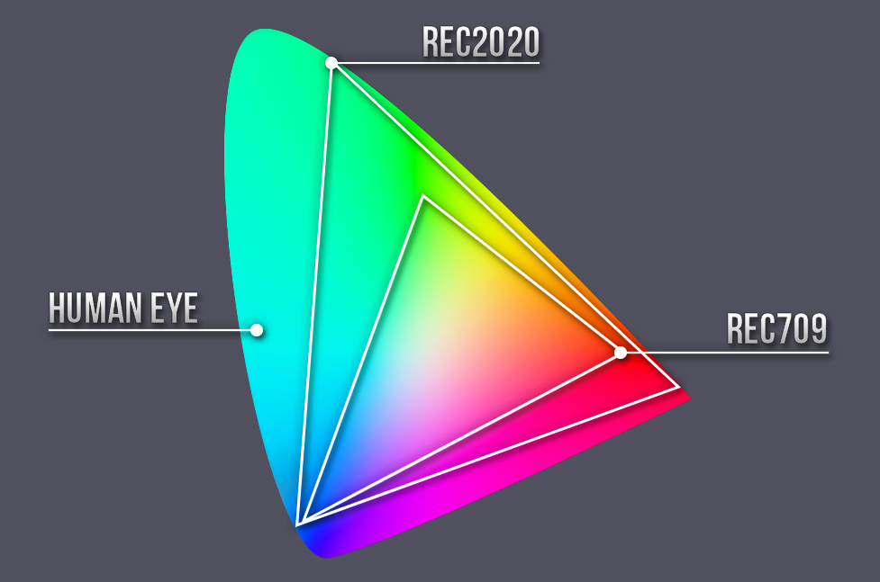
</p>

HDR also departs from the narrow color gamuts like [rec709](https://en.wikipedia.org/wiki/Rec._709) and [SRGB](https://en.wikipedia.org/wiki/SRGB) for wider color gamuts like [rec2020](https://en.wikipedia.org/wiki/Rec._2020) and [rec2100](https://en.wikipedia.org/wiki/Rec._2100).  Many displays may only have support a percentage of rec2020's full color spectrum in the same way that you'll often see technical spec listings like "%99 of SRGB space support".  Over time as rec2020 displays improve we're going to see color quality improve as we have a new standard everyone can use to get the color in our videos closer to what the sensitive human eye can see.

<p align="center">
  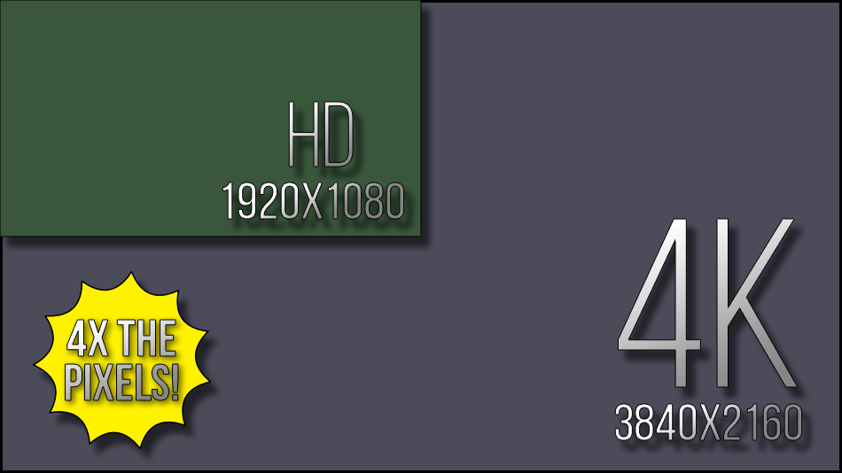
</p>

4K for HDR is not a strict requirement for platforms like YouTube and Vimeo, however it is part of specifications like "Ultra HD Premium".  Viewers on smartphones with HDR displays are probably under 4k resolution however many of the new HDR televisions sold will be 4k.

<p align="center">
  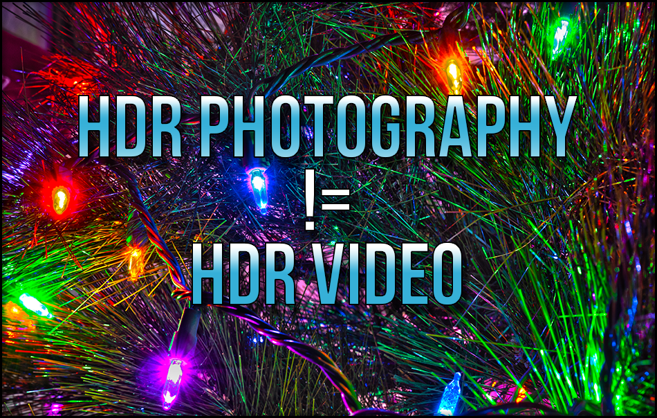
</p>

The way HDR photography works involves taking multiple exposure bracketed photographs and using software to perform what's called "tone mapping" which combines the best parts of the brightest parts of the dark image exposures and the darkest parts of the brightest image exposures.  This does expand the dynamic range of an image and is a useful technique for photographers, but is a different beast than HDR video.

Instead of taking multiple exposure bracketed shots for each frame and running tone mapping in software to display them on SDR displays using regular image file formats, the HDR video standards prescribe a color space/gamma/color depth and brightness attributes to store as well as a new display technology of monitors/televisions/smartphone screens/etc to display that particular kind of video file.

<p align="center">
  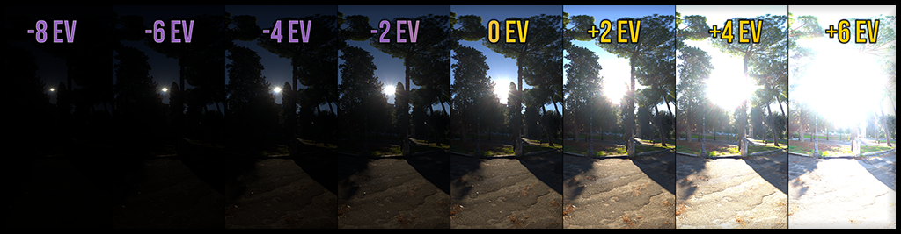
</p>

**NOT EVERY SCENE HAS A HIGH DYNAMIC RANGE!**  Imagine shooting a video about a grey piece of paper laying on a concrete floor in a well lit room.  5-6 stops of dynamic range might be all that is needed to capture the entire tonal range of a close-up shot of the paper on the concrete floor.  Not every shot will be looking out of a dimly lit cave into a brightly lit landscape.  Until I started experimenting with HDR it didn't occur to me to seek out scenes that contain a higher dynamic range.


# How To Shoot HDR Video?

## HDR Camera Specifications

| Camera Name | 10-bit color depth or higher | LOG or RAW color profile | 8+ stops of DR beats SDR, 10-13 stops are fine for HDR10 | 1080p - 4k resolution |
|-------------|-----------|--------------------------|---------------|------------|
| Panasonic GH5 | 10-bit | V-LOG and HLG | 12 stops | 4k |
| Blackmagic Pocket Cinema Camera 4k | 12-bit | cDNG and (soon) BRAW | 12+ stops  | 4k |
| Sony PXW-Z100 | 10-bit | Cinematone2 | 10 stops | 1080p |

A camera used to shoot HDR should ideally have some of the features above.  This is not intended to be a comprehensive list of all cameras.

There probably is also a list of "nice to haves" that might improve an HDR grade like higher than 4:2:2 chroma-subsampling and less highly compressed acquisition codecs.  On the GH5 for example most video is recorded in h264 or h265 but a firmware update was added to allowed recording in a 400Mbps All-I (interframe) long GOP codec.  There also is the option of attaching external recorders via HDMI to record in codecs not supported by the camera itself.  Codecs like ProRes/DNxHD (intermediary/mezzanine codecs) eat up a lot of space but are great high quality editing codecs that aren't as highly compressed as h264/h265.  Even more attractive is the Blackmagic RAW (BRAW) codec the BMPCC4K is supposed to be getting in a coming firmware update.

## Online Video Platform HDR Requirements

**It is my intent to attempt to upload my 4k 10-bit HDR MOV/DNxHR HQX masters right out of Resolve Studio whenever possible for maximum image quality** so long as the video is under say 12GB in size.  The bitrate of DNxHR profiles is fixed for a given resolution and framerate and at my preferred resolution of 4k and framerate of 29.976 frames per second I made a 47 second video which with DNxHR HQX and HDR metadata landed at 3.9GB in size.  If I multiply 3.9GB by 34 (minutes) we get 132GB which would exceed YouTube's maximum file size limit of 128GB.  So its probably a good idea to have a solution ready on how to re-encode our HDR10 masters to smaller sizes for cases when we go for longer videos and larger resolutions like 8K without stripping HDR metadata.

### YouTube

We need to workaround Resolve Studio not having a web deliverable codec with HDR metadata support on Windows or Linux.  This likely means either h265 or VP9.

I'll mention that while YouTube doesn't list support for ingesting h265 with HDR metadata it still works if you can send them a properly crafted file.  As of 12/2018 Resolve Studio doesn't export h265 with HDR metadata.  Resolve Studio on MacOS has HDR metadata support for VP9 built in, but not on Windows/Linux.  Basically Resolve on Windows doesn't have a convenient web deliverable codecs that supports HDR metadata which was one of the main motivations for creating this document to provide a workaround.  Premiere can export h265 with HDR metadata but I get strange shifts in color/gamma I can't fix.  Premiere also has other major problems with grading HDR10 where its still not recommended for finishing HDR content.

| NLE Suite | Support for HDR | Recommended |
|-----------|--------------------------|-------------|
| Premiere | h265, h264 in mp4 triggers as HDR on YouTube but color is bad, DNxHR won't work in Premiere because its in an mxf instead of a mov container | Not yet |
| Resolve Studio | Prores (Macos-only), VP9 (Macos-only), DNxHR | Yes |
| Final Cut Pro | Does have some HDR support but I'm unclear on the details | Maybe? |

16bit TIFF files, OpenEXR, and Cineform 12-bit are also fairly commonly supported and are good suitable intermediate HDR codecs.

I found a [google document written by Steve Robertson who works on HDR at YouTube that is dense with good information on publishing HDR to YouTube](https://docs.google.com/document/u/1/d/1OHGOE4Ihv6SKazfiub_DP1lJbR9PdMMPOQYxPJQAES4/pub#h.jd3wzt48geu).  Steve doesn't even mention h265.  He recommends VP9 maybe because [Google developed it](https://en.wikipedia.org/wiki/VP9), they [seem to promote it](https://youtube-eng.googleblog.com/2015/04/vp9-faster-better-buffer-free-youtube.html), have widely adopted it on YouTube, and VP9 competes directly against h265.

I stumbled on [a wonderful document written by some Google engineers about the VP9 codec used to compress HDR video](https://developers.google.com/media/vp9/hdr-encoding/).  This also included a reference to a [well maintained build script to compile ffmpeg optimized for 10-bit/vp9 support](https://github.com/id3as/ffmpeg-libvpx-HDR-static).

Next I sought the official windows build of ffmpeg to confirm if it supported the incantations of Google's VP9 HDR Encoding guide.  Any attempt to use it in a powershell/msdos prompt results in it exiting silently even with the highest debug level set (debug 56).  I then used Google's build script to compile ffmpeg with the correct VP9 support and found it to be suprisingly easy.

This repo contains a full set of instructions for using the ["Windows Subsystem for Linux" on Windows 10](https://docs.microsoft.com/en-us/windows/wsl/install-win10) to compile ffmpeg with vp9/10-bit support using Googles build script.  This repo also contains ```runme.bat``` MSDOS batch file which simply executes a ```ffmpeg_vp9_incantation.sh``` bash shell script that launches a particular ffmpeg incantation for VP9 encoding a DNxHR HQX HDR master video file.  ```runme.bat``` can be clicked in the windows explorer for easy launching.  The shell script will look for a file named ```HDR_master.mov``` which should ideally be DNxHR HQX in a MOV container.  This will output a file named ```HDR_VP9_output.mp4```, and if this file already exists it will be automatically overwritten which is why I recommend single project directories for processing one file at a time.  Also you can look for a ```ffmpeg-YYYYMMDD-######.log``` file which is created on every run of the script that can contain errors if they occur.

### Vimeo

I don't currently use Vimeo but it does have HDR support.  I'm more keen to document HDR workflows with YouTube initially but it might also be fun sometime to more thoroughly test Vimeo with HDR see what advantages it has over YouTube if any.

## Recommended Hardware for HDR

can record 10-bit color internally, has a LOG gamma profile (V-LOG) granting an extra stop of dynamic range for a total of 12 stops on the camera.  Months later the GH5 received a firmware update which allowed recording directly in HLG (Hybrid LOG Gamma), a dynamic HDR standard that uses rec2020 color space.  And then again another year later the GH5 receive a firmware update allowing an All-Intraframe 400Mbps codec which could reduce some of the compression of interframe h264/h265 in the previous acquisition codec selection.  Shooting HDR on the GH5 just looked more and more attractive so I began investigating HDR10 video on YouTube.

To engage in HDR content creation you will need:

1. An HDR monitor, TV, possibly even a phone/tablet with an HDR display.  To my surprise there are some great tips for grading HDR on an SDR display using monitor LUTs which have allowed me to get HDR grades that look great on an HDR display, however I still really want to see it in HDR before publishing anything.  I also recommend something like a [DeckLink Mini Monitor 4K HDMI output card](https://www.blackmagicdesign.com/products/decklink/techspecs/W-DLK-32) capable of sending a full 444 HDMI signal with HDR metadata to your HDR TV/Monitor so it can be used for 10-bit HDR display inside Resolve Studio as a dedicated monitor.

## Recommended Software for HDR

<p align="center">
  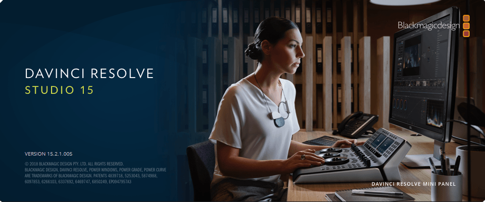
</p>

1. Resolve Studio.  If you are new to HDR and haven't already been making HDR videos you probably will want Resolve Studio.  It may not be used in some of the tutorials in this guide but its the top tool for HDR content creation right with its excellent color management, HDR support, and color grading capabilities.

### Setup an HDR Project in Resolve Studio 15

TODO: write more detailed instructions to accompany images

<p align="center">
  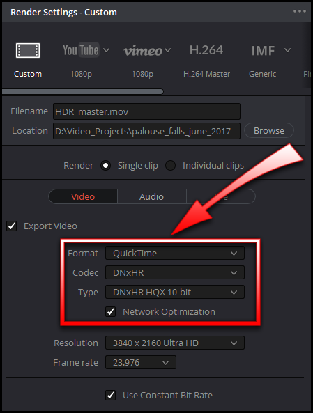
</p>

<p align="center">
  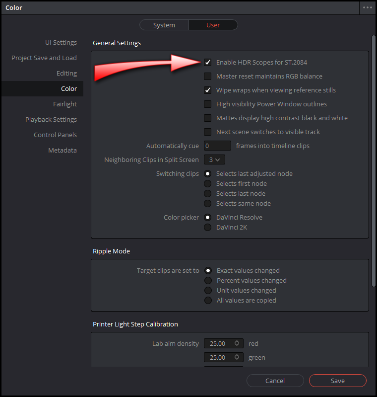
</p>

<p align="center">
  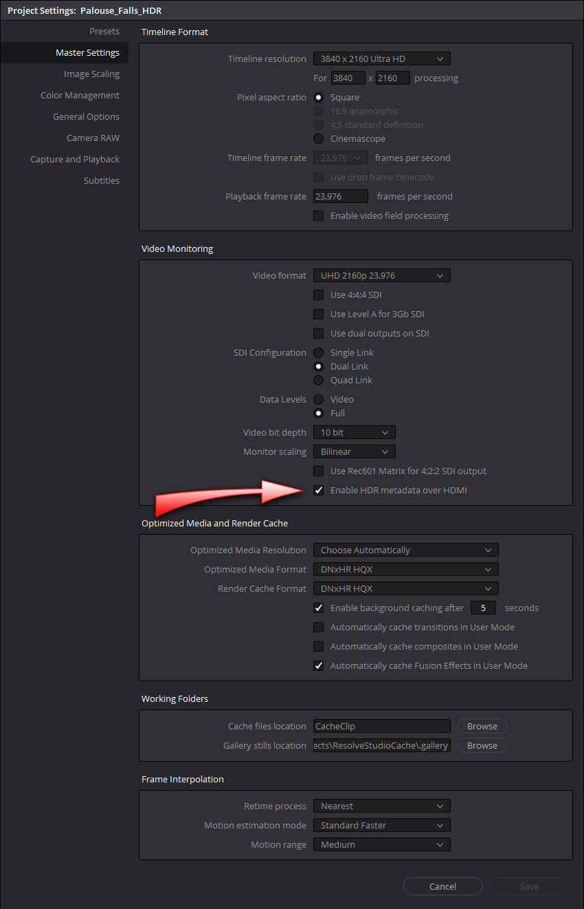
</p>

<p align="center">
  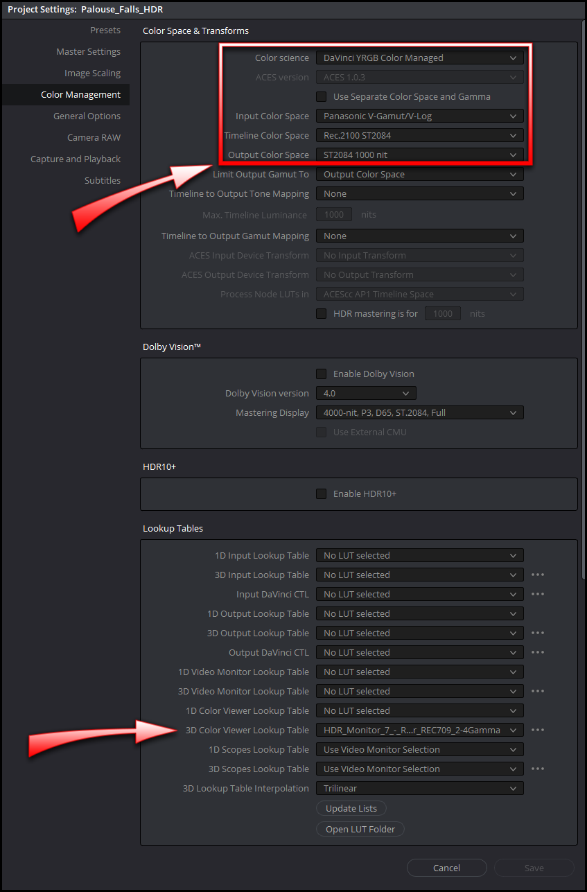
</p>

### SRGB Color Space in an HDR Project in Resolve Studio 15

<p align="center">
  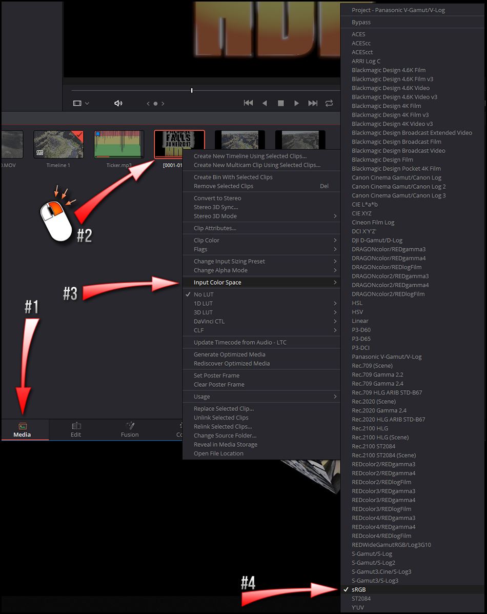
</p>

# Compiling ffmpeg With VP9 support

here we go

## Requirements For Compiling ffmpeg With VP9 Support

1. A running Windows 10 install, or a Centos/RHEL, or Debian/Apt Linux distribution.

2. [YouTube's Matroska Colour Metadata Ingestion Utility](https://github.com/YouTubeHDR/hdr_metadata)

3. My batch file and bash shell script in [the zip file that you can download right here](https://github.com/igarrison/HDRYouTubeCreatorGuide/archive/master.zip) and installing the Windows Subsystem for Linux (WSL) as instructed in the next section below.  WSL is needed to compile ffmpeg, its dependencies, and to run the resulting binary in a linux/posix environment where they encode VP9 more reliably.  If you don't care about VP9 on Windows or smaller HDR files then you don't need to bother with WSL or my zip file.

4. I also recommended downloading [Wesley Knapp's HDR_MetaJECTOR.bat](http://www.wesleyknapp.com/s/Wesley_Knapp-HDR_Tools_v3.zip) and .  These will be used for embedding HDR to SDR LUT files into your HDR files uploaded to YouTube if you find the automatic HDR to SDR conversion unsatisfactory.

## Compile VP9 Enabled ffmpeg

1. Linux users can skip to step 4.  In Windows 10 head to Control Panel > Programs > Turn Windows Features On Or Off. Enable the "Windows Subsystem for Linux" option in the list, and then click the OK button.  This will have you reboot your system when its finished.

2. open the Microsoft Store from the Start menu, and search for "Ubuntu".  As of 12/7/2018 I went with Ubuntu 18.04 LTS and it worked fine.  Click the "Get" button to download it.

3. Once Ubuntu 18.04 LTS is installed you'll see a "Launch" button, click that or in your Start Menu run "Bash on Ubuntu on Windows".  This is going to ask you to create a new user and password (does not need to match your Windows login) and will finish setting up Ubuntu.

4. Run the following commands below in the shell window to grab the ffmpeg-libvpx-HDR-static build script from Google's HDR engineers.  Note, this will prompt you for a password from the previous step to get some administrative permissions.  The script needs this to install a bunch of Ubuntu packages needed to fill dependencies needed for the build).  It will take roughly 30 minutes to compile ffmpeg and all of its dependencies.

```bash
$ curl https://raw.githubusercontent.com/id3as/ffmpeg-libvpx-HDR-static/master/build_static_ffmpeg_centos-debian.sh > ffmpeg-build-script.sh
$ chmod 766 ffmpeg-build-script.sh
$ sudo ./ffmpeg-build-script.sh
```

5. Assuming the build ran successfully we should have an 'ffmpeg' binary we can run.  Lets copy this file outside of this Linux environment to a place where you can easily click launch the script with the Windows Explorer.  In the bash shell lets make a directory on your C drive called "HDR2VP9" and copy the ffmpeg binary into it.

```bash
$ mkdir -p /mnt/c/HDR2VP9
$ cp ffmpeg_sources/ffmpeg/ffmpeg /mnt/c/HDR2VP9
```

## How To Compress an HDR Master to VP9

1. Using the Windows Explorer make a new project directory inside C:\HDR2VP9

2. Extract the contents of the [zip file in this repo](https://github.com/igarrison/HDRYouTubeCreatorGuide/archive/master.zip) into your new empty project directory.

3. Copy the ```C:\HDR2VP9\ffmpeg``` file into it.  This is the same file compiled from the previous section.

4. Copy your mov/DNxHR HQX HDR master file into the project directory and rename it to HDR_master.mov

5. Double click on runme.bat.  If all works correctly you'll see this program periodically output a log of text as its encoding.  When its done you should find a file 2pass_vp9_output.mp4 in the same directory.

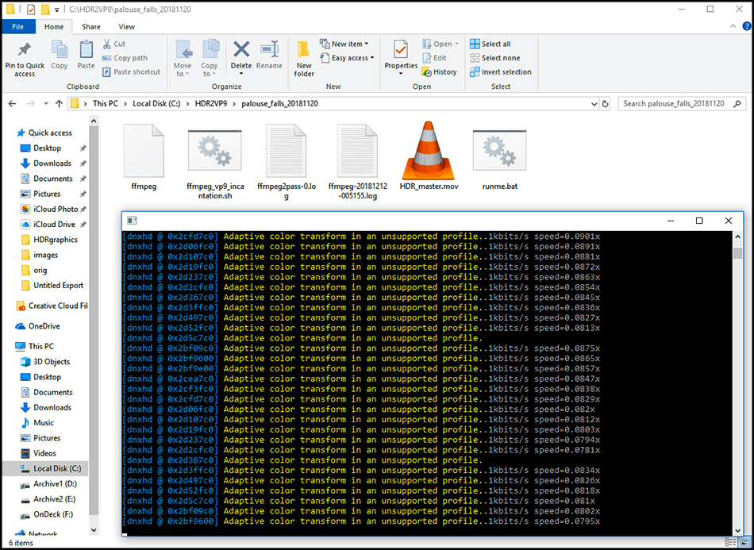

## HDR Bitrates

You should know the bitrate of all your cameras and footage they produce.  If you don't have this information use some media inspection tools (VLC, exiftool) or internet searches to try and determine the bitrates.  My my Panasonic GH5 shoots 150Mbps at 4k 10-bit 4:2:2 so this is my maximum upper limit on bitrate for my HDR videos.

[YouTube has their own recommendations for bitrates on uploaded videos](https://support.google.com/youtube/answer/1722171?hl=en).  Note that HDR videos are given a small additional amount of bitrate over SDR videos, just 2Mbps at 1080p but it can go up to +17Mbps in the most extreme case with 4k at the highest frame rates.

**Recommended bitrates for SDR uploads**

| Type | Video Bitrate, Standard Frame Rate (24, 25, 30) | Video Bitrate, High Frame Rate (48, 50, 60) |
|------|-------------------------------------------------|---------------------------------------------|
| 2160p (4k) | 35-45 Mbps |	53-68 Mbps |
| 1080p	| 8 Mbps | 12 Mbps |
| 720p | 5 Mbps | 7.5 Mbps |

**Recommended bitrates for HDR uploads**

| Type | Video Bitrate, Standard Frame Rate (24, 25, 30) | Video Bitrate, High Frame Rate (48, 50, 60) |
|------|-------------------------------------------------|---------------------------------------------|
| 2160p (4k) | 44-56 Mbps | 66-85 Mbps |
| 1080p | 10 Mbps | 15 Mbps |
| 720p | 6.5 Mbps | 9.5 Mbps |

I'm going to focus on DNxHR as its the preferred high quality mastering codec on Windows right out of Resolve.  Lets look at [DNxHR codec bandwidth specifications for 1080p and 4k UHD](http://avid.force.com/pkb/articles/en_US/White_Paper/DNxHR-Codec-Bandwidth-Specifications).  Lets ignore HQ, SQ, and LB profiles for DNxHR as they do not support 10-bit color (HDR is serious).  444 is listed below as it would support 10-bit color but its bitrate is excessively high for uploading to YouTube and I'm having a hard time imagining when its practical (if you really wanted to maintain high bitrates maybe?).

| Resolution | Codec | 23.976 | 29.97 | 59.94 |
|------------|-------|--------|-------|-------|
| HD | DNxHR 444 | 41.68Mbps | 52.10Mbps | 104.19Mbps |
| HD | DNxHR HQX | 20.79Mbps | 25.99Mbps | 51.98Mbps |
| UHD | DNxHR 444 | 166.61Mbps | 208.27Mbps | 416.54Mbps |
| UHD | DNxHR HQX | 83.26Mbps | 104.08Mbps | 208.15Mbps |

With encoding being a garbage-in/garbage-out operation we know that we should be uploading at bitrates meeting YouTube's recommendations at a minimum.  So with this information and my intent to publish at 4k at 29.97yfps I can determine that ideally I go no lower than 56Mbps as my minimum bitrate and no higher than 104Mbps (DNXHR HQX at 4k 29.976fps lowers my 150Mbps bitrate out of camera down to 104Mbps).

The default bitrate in ```ffmpeg_vp9_incantation.sh``` is 90Mbps minimum, 95Mbps average, and 100Mbps maximum.  These bitrates are optimized for 4k at 29.97fps which may be really high for 1080p HDR but you can use a text editor to modify the bash script to change these values.

## YouTube Optimizations for ffmpeg & Resolve Studio

Resolve and other editing suites may expose some but not all of a codec's parameters so videos may not always strictly comply with YouTube's recommendations.  Their video ingestion systems are fairly flexible and mostly do a great job of making the best video as quickly as they can with what you upload to them.  I've already added these flags to ```ffmpeg_vp9_incantation.sh```.

* [YouTube recommends a moov atom at the front of the file (fast start)](https://support.google.com/youtube/answer/1722171?hl=en).  Make sure to use a streaming format, like an mkv, .mp4 or a .mov, with the metadata at the front of the container YouTube will begin processing your video WHILE you are uploading it, drastically reducing overall turnaround time. This will make things MUCH faster, with no negative side effect."  The "Network Optimization" checkbox under delivery in Resolve Studio does this but we want it maintained through our ffmpeg encodes as we could be dealing with huge files.  This is ```-movflags +faststart``` in ffmpeg.

* [YouTube recommends 2 consecutive B frames](https://support.google.com/youtube/answer/1722171?hl=en).  This is ```-bf 2``` in ffmpeg.

* [YouTube recommends close GOP](https://support.google.com/youtube/answer/1722171?hl=en).  This is ```-flags +cgop``` in ffmpeg.

* [Consider this Encoding for Youtube article which contains tips by google video infrastructure engineer Colleen Henry](http://www.streamingmedia.com/Articles/Editorial/Featured-Articles/Encoding-for-YouTube-How-to-Get-the-Best-Results-83876.aspx) which says "You can noticeably improve the quality of your video on YouTube by using a sophisticated, scene aware, denoising filter prior to uploading."  The denoise features in Resolve Studio is pretty good and we should use it whenever, but don't push it too far as it the reduces details in your image.

## Results

You can tune the encoding speed by editing ```ffmpeg_vp9_incantation.sh``` if you are willing to sacrifice some quality for speed.  Its a value between 0 (slowest/best quality) and 4 (fastest/lowest quality) and the default is 1.  You can also adjust other things like the container, bitrate, and input/output filenames as well.

Click on the images to see the example video on YouTube.  TODO: replace the images with the exact same video frame for a better side by side comparison.

**BEFORE VP9 ENCODING:** Consider this the scientific control.  Its a 3.9GB 47 second MOV/DNxHR HQX HDR master straight out of Resolve Studio to Youtube and processed by YouTube's automatic HDR to SDR conversion.  [Link to high quality image](images/HDR_master.png).

[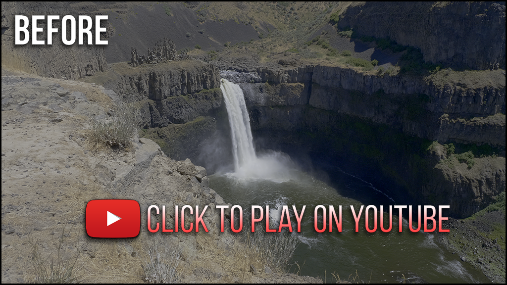](https://www.youtube.com/watch?v=5eDVhFBoc20)

 **AFTER VP9 ENCODING**: the VP9 encode it took 49 minutes to reduce this 47 second 3.9GB video to 362MB without stripping HDR metadata using the workflow recommended by Google VP9/infrastructure/HDR engineers.   This also uses YouTube's automatic HDR to SDR conversion.  WARNING: My PC is a beefy 10-core i9-7900X with 64GB RAM and this encoding is very slow but the speed is configurable!  [Link to high quality image](images/HDR_VP9_output.png)

[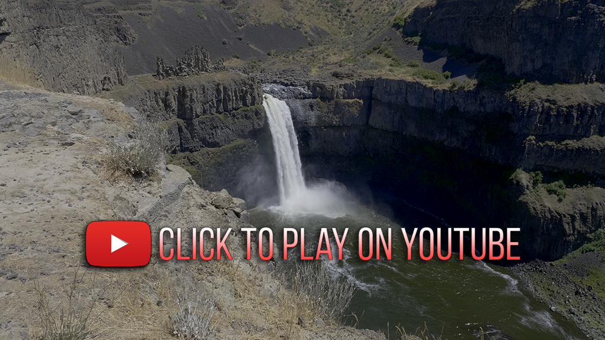](https://www.youtube.com/watch?v=dV4p5qQx9Kw)

Image quality differences can be seen especially in areas of motion (the waterfall) and there does appear to be a slight shift in color tint towards green or yellow.  I think the sharpness and quality of details is remarkably good for the static portions of the video in a side by side comparison.  Is it as high of quality as the DNxHR master?  No, but that wasn't the goal though!  We should only be using VP9 because our DNxHR masters are too large to upload to YouTube, our back is to a wall, and we need options like VP9/h265 to make some size/image quality trade-offs!  In the context of the 3.9GB -> 362MB reduction in file size while maintaining 10-bit color and HDR metadata I think the VP9 results here are still a huge win.

# HDR to SDR Conversion LUTs (YouTube)

## Creating a Custom HDR to SDR LUT

YouTube will automatically convert SDR versions of your HDR videos uploaded to them, however if you dislike this color grade you can embed a LUT file into the video uploaded to YouTube that they will use for the SDR conversion process.  This is roughly how its done in Resolve Studio.

<more notes here>

## Embedding Custom HDR to SDR LUT Files

1. Download [YouTube's Matroska Colour Metadata Ingestion Utility](https://github.com/YouTubeHDR/hdr_metadata) for your given platform.  Copy mkvinfo.exe/mkvmerge.exe into the same project directory.

2. I recommend grabbing [Wesley Knapp's HDR_MetaJECTOR batch file](http://www.wesleyknapp.com/s/Wesley_Knapp-HDR_Tools_v3.zip) to simplify launching the mkvmerge incantation to inject HDR metadata or attach a SDR to SDR LUT file.  Copy the HDR_MetaJECTOR batch file into the same project directory.

3. Double click on the ```HDR_MetaJECTOR.bat``` script in Windows Explorer.  This will launch an MSDOS window which you can drag-and-drop both your ```HDR_VP9_output.mp4``` and any LUT files to embed into your video file prior to uploading to YouTube.  It only takes a couple seconds to run and will produce a new file with your VP9 stream in a new ```.mkv``` container.

<p align="center">
  
</p>

# FAQ

Q. Premiere for HDR video?

A. No, not yet!  It does have rec2020/HDR scopes, the ability to export 10-bit h265 with HDR metadata, but a few of its major flaws: 1) The viewports and external monitors managed by Premiere are rec709-only and everything being displayed will peak as soon as brightness is pushed at or above 120 nits.  [Mysterybox writes about the problem here if you search for 120 nits](https://www.mysterybox.us/blog/2016/11/17/adobe-premiere-cc-2017-real-world-feature-review).  This means you cannot ever see what you grade in Premiere no matter what you do, and I'm not jedi enough to ONLY use the scopes. and 2) Premiere lacks any real color management support which is something that instantly becomes more complicated when you leave the srgb/rec709 world for the wild west of rec2020 and are having to deal with LOG gamma curves directly because there aren't as many rec2020 LUTs as there are for rec709/SRGB.  I love Premiere for editing but it has been a big disappointment when it comes to HDR as I lost months trying to make it work until I became aware of its shortcomings.

---

Q. This whole Rube Goldberg machine with a Linux environment to run a custom compiled version of ffmpeg with a shell script called by a bath file... really?  Why can't you suggest something better?  What about XYZ?

A. I couldn't find any windows builds of ffmpeg with vp9 support that didn't have problems with a 2-pass encodes.  Maybe this will get fixed in a future build.  If anyone sees workflow improvements please email me.  I'm a Linux guy so solutions in that ecosystem are easy to me even if they seem awkward on the Windows platform.

---

Q. Why not HEVC/h265 instead of VP9 out of ffmpeg?

A. It performs similarly to VP9 and is gaining more support all the time.  It has the advantage that you could just use the official ffmpeg builds for h265 and skip on compiling ffmpeg entirely.  I think h265 is great and probably would have used it if I hadn't stumbled on some of those google engineer writings about VP9.  I've used h265 a fair bit but haven't ever done anything with VP9 before.  I have also heard a few smart engineers talking about some of the technical merits of vp9 over h265 for more efficient compression that I've been meaning to see for myself.

---

Q. What is the deal with 10-bit color on Geforce cards on Windows?  Do I need to buy a Quadro card for HDR?

A. TODO: I've got some good responses the 10-bit/HDR display problems.

---

Q. How to integrate RAW/DNG images and OpenEXR's into Resolve Studio for HDR?

A. TODO: Something I'd like to know.

---

Q. How do you manage different color spaces and gammas in Resolve Studio in an HDR project?  All of my photos and motion graphics are SRGB apparently!

A. TODO: I'm aware of a few ways to do this, but should just pick one method and document it.  If there is a better way hopefully somebody will tell me.

---

Q. Is HDR Photography like HDR Video?

A. No!

---

Q. I think my monitor has 10-bit color and I even think it can hit 500 nits brightness!  I can view HDR video yes?

A. Maybe.  Apple ships some iMacs and Retina displays which look great for HDR on paper but don't support any HDR standards.  Dell released the U2518D which advertised HDR support while only being able to hit 350 nits brightness, only supporting 8-bit color depth, and not listing any rec2020 support.  Be wary that some HDR monitors that may be more inexpensive or aimed towards less informed consumers may fall short on their ability to display HDR video in its fullest glory.  Always check the specs!


# Special Thanks

Daniel Gordon

# Author

Ian Garrison <garrison@technoendo.net>

# Additional Resources

[WebM Project's VP9 Encoding Guide](http://wiki.webmproject.org/ffmpeg/vp9-encoding-guide).

[FFMPEG.org's VP9 Encoding Guide](https://trac.ffmpeg.org/wiki/Encode/VP9).

[Wesley Knapp's blog article on Grading HDR video on a rec709 monitor for youtube & beyond](http://www.wesleyknapp.com/blog/hdr).

Mystery Box has written many excellent blog posts on HDR: [like this](https://www.mysterybox.us/blog/2016/10/27/hdr-video-part-5-grading-mastering-and-delivering-hdr) and [this one](https://www.mysterybox.us/blog/2016/11/7/how-to-upload-hdr-video-to-youtube-with-a-lut), and they also [sell a bunch of HDR LUT files on their online store for cameras like the GH5/GH5S](https://www.mysterybox.us/blog/2018/1/8/panasonic-gh5s-hdr10).

[Alexis Van Hurksman's blog on HDR, Resolve, and Creative Grading](http://vanhurkman.com/wordpress/?p=3548).

[YouTube video from CRFTSHO titled Easy HDR video for YOUTUBE/vimeo tutorial part 2 - how to set up your project for HDR workflow](https://www.youtube.com/watch?v=QJAiR6lh9Z0).
